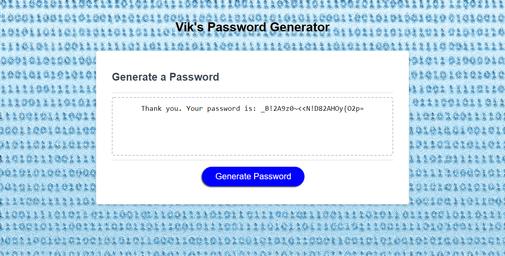

# Vik's Password Generator

## Description

Online security is a big deal! For people with access to sensitive information, securing that information is a critial part of working online. And in order to provide adequate security, sometimes information needs to be protected with a strong, unbreakable password.

Enter the purpose of this project: to create an application that generates a random passowrd based on user-selected length and character criteria. The goal was to create a simple, straightforward app that operates in the browser, has a clean and simple interface, and can be accessed from anywhere.

The achieve this goal, the following were accomplished as part of the application: 

- customize html and css elements for page to accept user inputs
- present the user with a prompt asking for their desired length of password (between 8 and 128 characters)
- present the user with a series of prompts asking the user for their desired critera for the characters they want included in the password 
- ensure that the user is not able to enter the wrong or incorrect prompts
- generate a unique password based on the user inputs that is written to the page for the user

After accomplishing those aspects of the application the user can simply, and in just a matter of moments, generate their own unique password of their desired length and character-inclusion.

Link to the deployed website: https://vik-maharaj.github.io/password-generator/

## Installation

The repo contains an index.html file, and assets folder containing a CSS file sytlesheet and corresponding images. These files were deployed at the above mentioned link using GitHub Pages. The repo can also be cloned to a local machine and the index.html file can be opened in any web browser or IDE of choice.

## Usage

Using any dekstop browser, open the above mentioned link to view the webpage.

## Credits

Source code courtesy of © 2022 Trilogy Education Services, LLC, a 2U, Inc. brand. Confidential and Proprietary. All Rights Reserved.

Other collaborators include the instructor, TAs, and fellow classmates of the UCF Coding Bootcamp (Spring 2022).

## License

Copyright (c) 2022 Vik Maharaj

Permission is hereby granted, free of charge, to any person obtaining a copy of this software and associated documentation files (the "Software"), to deal
in the Software without restriction, including without limitation the rights to use, copy, modify, merge, publish, distribute, sublicense, and/or sell copies of the Software, and to permit persons to whom the Software is furnished to do so, subject to the following conditions:

The above copyright notice and this permission notice shall be included in all copies or substantial portions of the Software.

THE SOFTWARE IS PROVIDED "AS IS", WITHOUT WARRANTY OF ANY KIND, EXPRESS OR IMPLIED, INCLUDING BUT NOT LIMITED TO THE WARRANTIES OF MERCHANTABILITY,
FITNESS FOR A PARTICULAR PURPOSE AND NONINFRINGEMENT. IN NO EVENT SHALL THE AUTHORS OR COPYRIGHT HOLDERS BE LIABLE FOR ANY CLAIM, DAMAGES OR OTHER LIABILITY, WHETHER IN AN ACTION OF CONTRACT, TORT OR OTHERWISE, ARISING FROM, OUT OF OR IN CONNECTION WITH THE SOFTWARE OR THE USE OR OTHER DEALINGS IN THE SOFTWARE.

## Badges

